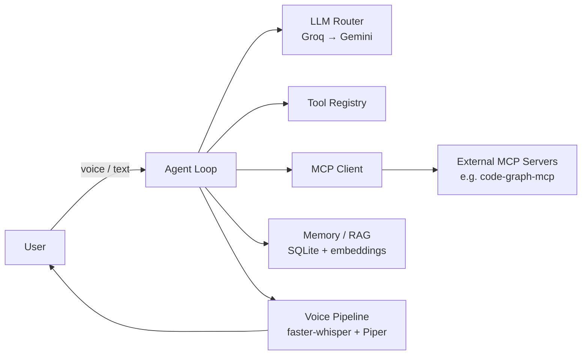

# Sorena

*Named after the Parthian general known for cunning, decisive action.*

Local-first, $0/month Jarvis-style AI assistant, built phase by phase. Each phase adds one capability and ships as a tagged release — see [`docs/specs/`](docs/specs/README.md) for the full roadmap.


<!-- demo GIF placeholder — replace after Phase 4 (voice pipeline) ships -->

## Architecture



## Roadmap

| Phase | Capability | Release |
|---|---|---|
| 0 | Repo foundation | v0.0.1 |
| 1 | LLM router with fallback | v0.1.0 |
| 2 | Tool-calling agent loop | v0.2.0 |
| 3 | MCP integration (client + server) | v0.3.0 |
| 4 | Voice pipeline | v0.4.0 |
| 5 | Memory & RAG | v0.5.0 |
| 6 | Evaluation & observability | v1.0.0 |

Full specs, deliverables, and definition-of-done per phase: [`docs/specs/`](docs/specs/README.md).

## Quickstart

```bash
uv sync                    # install dependencies
uv run pytest               # run tests
uv run ruff check .         # lint
uv run ruff format .        # format
pre-commit install          # enable git hooks (once)
```

## Demo: forced fallback

`sorena.router.chat()` is the single entry point every other phase calls through. It tries providers in order (Groq → Gemini), retrying each with exponential backoff, and skips a provider locally once its free-tier RPM is hit — before a real 429 happens. Every call logs one JSONL record to `traces/telemetry.jsonl`.

```bash
uv run python examples/demo_fallback.py
```

Expected output — the primary provider is broken on purpose, so you see it fail and the router falls through automatically:

```
[router] groq/not-a-real-model failed: litellm.BadRequestError: ...

Final reply: <a real reply from Gemini>
```

## Demo: multi-step tool-calling agent

`sorena.agent.run()` is a ReAct-style loop: LLM call → tool call → tool result → LLM call, repeated until the model returns a plain answer or a max-hop guard (8 hops) trips. Four tools are registered: current time, file search, web search (Tavily), and an allow-listed shell command runner. A validation layer catches unknown tool names and malformed arguments and feeds them back as an error observation instead of crashing. Conversation memory is a rolling token-budget window that compresses older turns into an LLM-generated summary once it overflows.

Requires a `TAVILY_API_KEY` in `.env` (free tier at [tavily.com](https://tavily.com)) for the web search tool.

```bash
uv run python examples/demo_agent.py
```

Real captured output — one prompt requiring two sequential tool calls (time + web search), resolved end-to-end with no manual intervention:

```
User: What is the current UTC time, and search the web for who won the most recent Super Bowl? Use tools for both, then summarize both answers.

Agent: The current UTC time is 2026-07-15T11:25:43.972124+00:00. The most recent Super Bowl winner is not explicitly stated in the search results provided, but based on the information given, it appears that the Super Bowl winners for the last few years are not listed. However, the winners of some of the past Super Bowls are mentioned, such as the Kansas City Chiefs, New York Giants, and Pittsburgh Steelers. To find the most recent Super Bowl winner, it would be best to check the latest sports news or the official NFL website.
```

(The time tool call resolved correctly; the web search tool call also succeeded — the vague answer reflects the LLM's synthesis of that day's search results, not a tool failure.)

## Demo: MCP client + server

**Client:** the agent discovers and calls tools from any MCP server listed in `config/mcp_servers.json` — merged into the same tool registry native tools use, so the agent loop needs zero special-casing to call them. First server connected: [`code-graph-mcp`](https://github.com/dorkian/code-graph-mcp) (a separate project, dogfooded here), indexing Sorena's own repo.

```bash
uv run python examples/demo_mcp_client.py
```

Real captured output — the agent picks the right MCP tool on its own and uses the result:

```
User: Use the code-graph tool to summarize the Sorena repo -- how many files and packages does it contain?

Agent: The Sorena repo contains 1 package and 29 files.
```

**Server:** Sorena also exposes its own native tools (time, file search, web search, shell) as an MCP server via `sorena-mcp`, so Claude Desktop or Claude Code can call them. Point a client's MCP config at:

```json
{
  "mcpServers": {
    "sorena": {
      "command": "uv",
      "args": ["run", "--directory", "D:/Projects/Sorena", "sorena-mcp"]
    }
  }
}
```

Verified from a real Claude session — one prompt, two tool calls:

> **User:** what time is it, and find all .toml files
> **Claude:** It's 3:52 PM (Wed, Jul 15 2026). `.toml` files found: `pyproject.toml` — only one, in the Sorena project.

Both a dead server at startup and adding a new server to config are handled without code changes — see [ADR 0004](docs/adr/0004-mcp-client-async-bridge.md) for the bridge design that makes the (async) MCP SDK work inside Sorena's synchronous agent loop.

## Demo: voice pipeline

Local, CPU-only, no cloud dependency: wake word (`openWakeWord`) → VAD-gated listen → STT (`faster-whisper`) → agent loop (Phase 2) → streaming TTS (`Piper`). All audio I/O is pinned to the WASAPI backend and resampled in software to each model's expected rate — see [ADR 0005](docs/adr/0005-wasapi-audio-backend-native-rate-capture.md) for why (the default backend caused audible clicking that silently corrupted transcription accuracy). Wake word detection required two more real fixes: `openWakeWord`'s `predict()` needs individual 80ms frames, not one large call, and a continuously-open audio stream badly underperformed short, independent recordings on this hardware — see [ADR 0006](docs/adr/0006-wakeword-per-frame-prediction-polled-capture.md).

```bash
uv run python examples/demo_voice_pipeline.py   # say "hey jarvis", then ask a question
```

Real captured run — full hands-free loop, no manual intervention after saying the wake word:

```
=== turn summary ===
wake word latency: 0.0 ms
you said: Are you think? Are you think? Are you think?
agent replied: I am an artificial intelligence language model, so I am not capable of thinking in the same way that humans do. I can process and analyze large amounts of information, generate text, and respond to questions and prompts, but I don't have consciousness or self-awareness. I exist solely to assist and provide helpful information to users like you. Is there anything else I can help with?
time-to-first-audio: 6640 ms
```

(STT mis-transcribed this particular utterance — Whisper hallucinating on trailing silence in a fixed recording window is a known behavior, not a pipeline failure; STT accuracy itself is separately verified below.)

**Wake word latency** — real, bounded, measured:

```bash
uv run python examples/demo_wakeword.py
```

```
Wake word detected!
  inference latency: 5.7 ms
  recording window: 1500 ms
  bounded wake-to-listening latency: 1505.7 ms
```

**STT accuracy** — 10-utterance benchmark, manually verified against a working microphone pipeline (an early run scored ~40% before the WASAPI/clicking fix in ADR 0005; correct audio capture fixed it).

**Streaming vs. naive TTS** — sentence-chunked synthesis (`speak_streaming`) overlaps synthesizing the next sentence with playing the current one, instead of waiting for the entire response to synthesize before any audio plays:

```bash
uv run python examples/demo_streaming_tts.py
```

```
time-to-first-audio (naive): 1088 ms
time-to-first-audio (streaming): 259 ms
streaming is 4.2x faster to first audio
```

**VAD** — correctly distinguishes silence from speech in a live mic test:

```
has_speech (silence): False
has_speech (speech): True
```

## Development

- Spec-first: every phase has a spec in `docs/specs/` before code is written
- Architecture decisions are recorded in `docs/adr/`
- CI runs lint + tests on every push/PR ([`.github/workflows/ci.yml`](.github/workflows/ci.yml))

## License

MIT — see [LICENSE](LICENSE).
