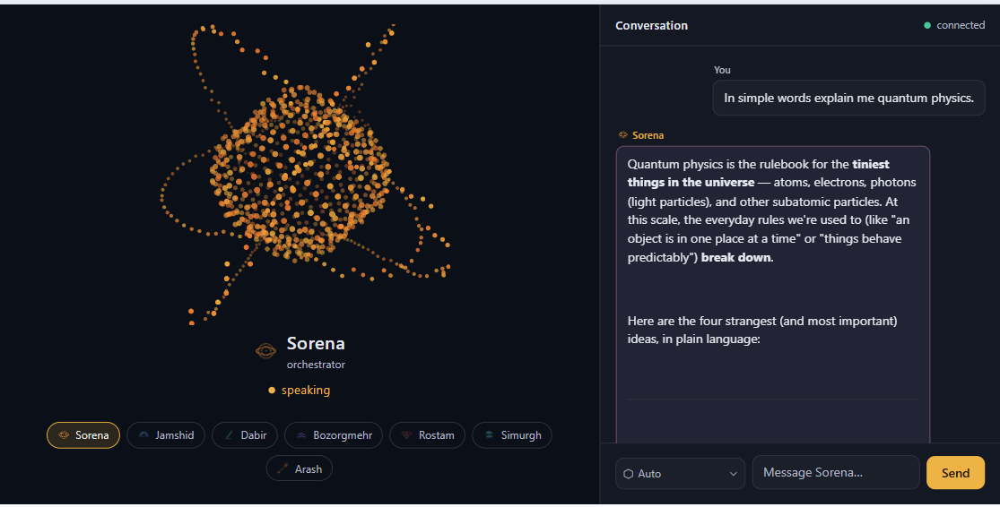
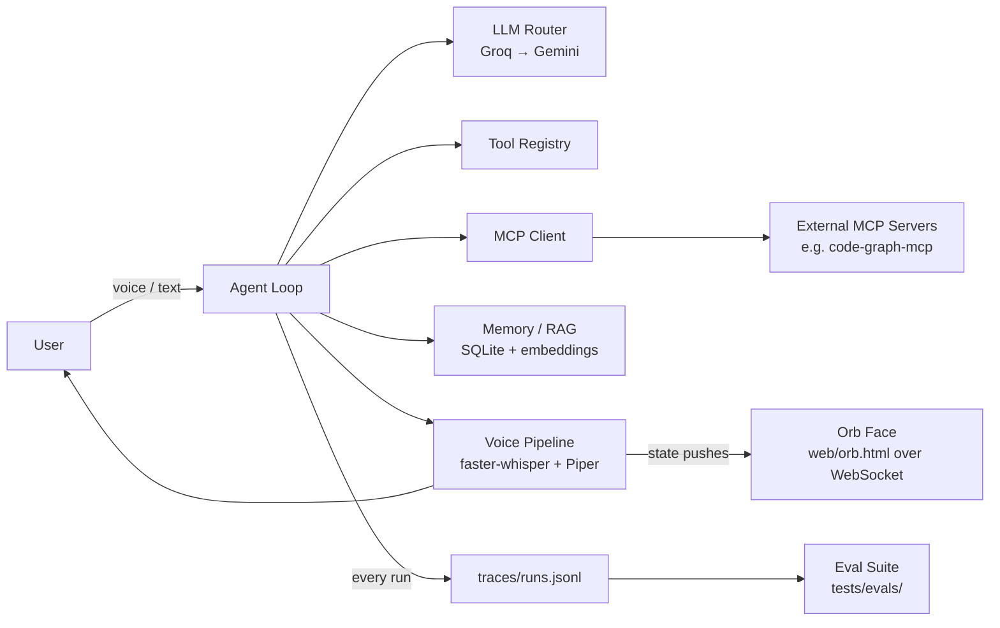
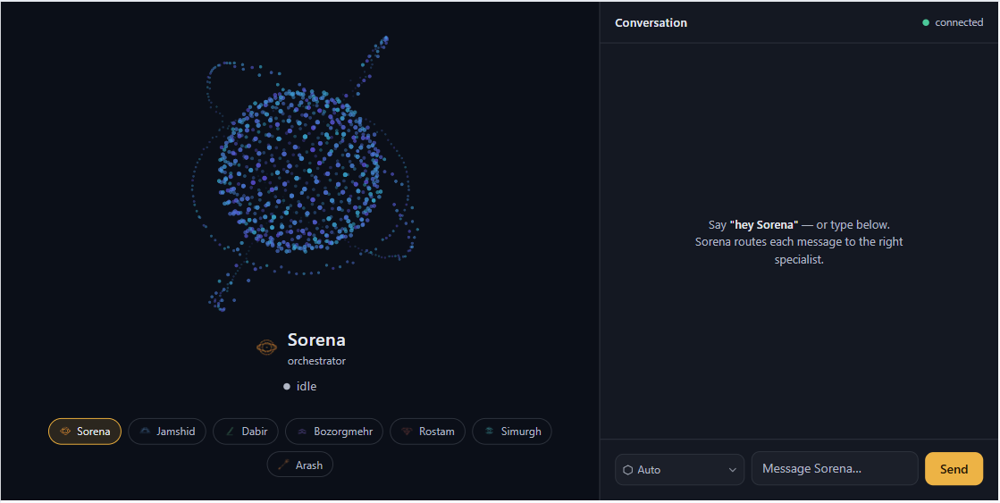
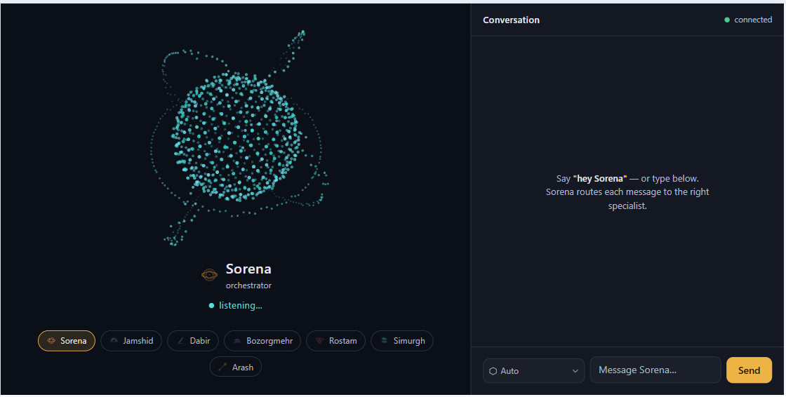
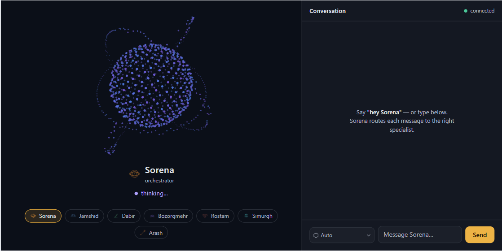

# Sorena

*Named after the Parthian general known for cunning, decisive action.*

Local-first, $0/month Jarvis-style AI assistant, built phase by phase. Each phase adds one capability and ships as a tagged release — see [`docs/specs/`](docs/specs/README.md) for the full roadmap.



## Architecture



## Roadmap

| Phase | Capability | Release |
|---|---|---|
| 0 | Repo foundation | v0.0.1 |
| 1 | LLM router with fallback | v0.1.0 |
| 2 | Tool-calling agent loop | v0.2.0 |
| 3 | MCP integration (client + server) | v0.3.0 |
| 4 | Voice pipeline | v0.4.0 |
| 5 | Memory & RAG | v0.5.0 |
| 6 | Evaluation & observability | v1.0.0 |
| 7 | JobScout graph (LangGraph + Postgres/pgvector RAG) | v1.1.0 |

Full specs, deliverables, and definition-of-done per phase: [`docs/specs/`](docs/specs/README.md).

## Face UI

`web/index.html` is the full assistant face: the orb (state + active persona), a live transcript of voice *and* text turns, and a composer that sends text turns to the orchestrator over the same WebSocket bridge (`src/sorena/face.py`, port 8765). Text-only mode, no voice pipeline needed:

```bash
uv run python -m sorena.face     # start the bridge
# then open web/index.html in a browser (or serve web/ with any static server)
```

`web/orb.html` remains the minimal orb-only face used by the voice pipeline docs.



## Quickstart

```bash
uv sync                    # install dependencies
uv run pytest               # run tests
uv run ruff check .         # lint
uv run ruff format .        # format
pre-commit install          # enable git hooks (once)
```

## Configuration

Copy `.env.example` to `.env` and fill in your API keys. The LLM provider
fallback chain is also configurable there -- `SORENA_PROVIDER_CHAIN` (which
models to try, in order) and `SORENA_RATE_LIMITS_RPM` (local per-model rate
caps) both default to Groq + Gemini in `src/sorena/config.py`, but can be
overridden per-deployment without touching code, e.g. to add another
provider or drop one that's hit its quota:

```bash
SORENA_PROVIDER_CHAIN=groq/llama-3.3-70b-versatile,anthropic/claude-3-5-haiku-20241022,gemini/gemini-3.1-flash-lite
SORENA_RATE_LIMITS_RPM=groq/llama-3.3-70b-versatile:30,anthropic/claude-3-5-haiku-20241022:20,gemini/gemini-3.1-flash-lite:15
```

Each entry is a [litellm](https://docs.litellm.ai/docs/providers) model
string (`provider/model-name`) with a matching API key env var for that
provider (e.g. `ANTHROPIC_API_KEY`) set alongside it.

### NVIDIA NIM (build.nvidia.com)

NVIDIA's free-tier API catalog gives access to NVIDIA's own hosted models
plus partner models (GLM, MiniMax, Qwen, etc) through one OpenAI-compatible
endpoint. Get a key at [build.nvidia.com](https://build.nvidia.com) (Login
-> open any model page -> "Generate API Key"), set `NVIDIA_NIM_API_KEY` in
`.env`, then add a `nvidia_nim/<org>/<model>` entry to the chain -- litellm's
`nvidia_nim` provider handles the rest:

```bash
NVIDIA_NIM_API_KEY=nvapi-...
SORENA_PROVIDER_CHAIN=groq/llama-3.3-70b-versatile,nvidia_nim/nvidia/nemotron-3-ultra-550b-a55b,gemini/gemini-3.1-flash-lite
SORENA_RATE_LIMITS_RPM=groq/llama-3.3-70b-versatile:30,nvidia_nim/nvidia/nemotron-3-ultra-550b-a55b:40,gemini/gemini-3.1-flash-lite:15
```

The exact model string for any model on the site is on its model page under
"Prototype" (e.g. `nvidia/nemotron-3-ultra-550b-a55b`, `z-ai/glm-5.2`) --
copy it as-is and prefix with `nvidia_nim/`.

### OpenRouter (GPT and others)

OpenRouter gives access to GPT models (and hundreds of others) through one
OpenAI-compatible endpoint. Get a key at
[openrouter.ai](https://openrouter.ai) (Sign in -> Keys -> Create Key), set
`OPENROUTER_API_KEY` in `.env`, then add an `openrouter/<org>/<model>` entry
to the chain -- litellm's `openrouter` provider handles the rest:

```bash
OPENROUTER_API_KEY=sk-or-...
SORENA_PROVIDER_CHAIN=groq/llama-3.3-70b-versatile,openrouter/openai/gpt-oss-120b,gemini/gemini-3.1-flash-lite
SORENA_RATE_LIMITS_RPM=groq/llama-3.3-70b-versatile:30,openrouter/openai/gpt-oss-120b:30,gemini/gemini-3.1-flash-lite:15
```

`gpt-oss-120b` is OpenAI's open-weight model and is very cheap (~$0.03/$0.18
per M tokens) -- a good default alongside the free-tier providers above. For
the frontier GPT line, use e.g. `openrouter/openai/gpt-5.6-sol` (flagship,
$5/$30 per M tokens) or `openrouter/openai/gpt-5.6-luna` (cheaper, faster).
The exact model string for any model is on its
[model page](https://openrouter.ai/models) -- copy it as-is and prefix with
`openrouter/`.

### Picking a model in the chat UI

`web/index.html`'s composer has a model dropdown, populated from whatever
`SORENA_PROVIDER_CHAIN` the running `sorena.face` process resolved (sent to
the browser as a `config` message on connect -- see `face.py`'s
`_handler`). "Auto (fallback chain)" is the default and behaves exactly like
before (tries each model in order until one succeeds); picking a specific
model forces that one model for the turn, with no fallback -- if it fails,
the error is surfaced rather than silently trying something else you didn't
choose.

## Demo: forced fallback

`sorena.router.chat()` is the single entry point every other phase calls through. It tries providers in order (Groq → Gemini), retrying each with exponential backoff, and skips a provider locally once its free-tier RPM is hit — before a real 429 happens. Every call logs one JSONL record to `traces/telemetry.jsonl`.

```bash
uv run python examples/demo_fallback.py
```

Expected output — the primary provider is broken on purpose, so you see it fail and the router falls through automatically:

```
[router] groq/not-a-real-model failed: litellm.BadRequestError: ...

Final reply: <a real reply from Gemini>
```

## Demo: multi-step tool-calling agent

`sorena.agent.run()` is a ReAct-style loop: LLM call → tool call → tool result → LLM call, repeated until the model returns a plain answer or a max-hop guard (8 hops) trips. Four tools are registered: current time, file search, web search (Tavily), and an allow-listed shell command runner. A validation layer catches unknown tool names and malformed arguments and feeds them back as an error observation instead of crashing. Conversation memory is a rolling token-budget window that compresses older turns into an LLM-generated summary once it overflows.

Requires a `TAVILY_API_KEY` in `.env` (free tier at [tavily.com](https://tavily.com)) for the web search tool.

```bash
uv run python examples/demo_agent.py
```

Real captured output — one prompt requiring two sequential tool calls (time + web search), resolved end-to-end with no manual intervention:

```
User: What is the current UTC time, and search the web for who won the most recent Super Bowl? Use tools for both, then summarize both answers.

Agent: The current UTC time is 2026-07-15T11:25:43.972124+00:00. The most recent Super Bowl winner is not explicitly stated in the search results provided, but based on the information given, it appears that the Super Bowl winners for the last few years are not listed. However, the winners of some of the past Super Bowls are mentioned, such as the Kansas City Chiefs, New York Giants, and Pittsburgh Steelers. To find the most recent Super Bowl winner, it would be best to check the latest sports news or the official NFL website.
```

(The time tool call resolved correctly; the web search tool call also succeeded — the vague answer reflects the LLM's synthesis of that day's search results, not a tool failure.)

## Demo: MCP client + server

**Client:** the agent discovers and calls tools from any MCP server listed in `config/mcp_servers.json` — merged into the same tool registry native tools use, so the agent loop needs zero special-casing to call them. First server connected: [`code-graph-mcp`](https://github.com/dorkian/code-graph-mcp) (a separate project, dogfooded here), indexing Sorena's own repo.

```bash
uv run python examples/demo_mcp_client.py
```

Real captured output — the agent picks the right MCP tool on its own and uses the result:

```
User: Use the code-graph tool to summarize the Sorena repo -- how many files and packages does it contain?

Agent: The Sorena repo contains 1 package and 29 files.
```

**Server:** Sorena also exposes its own native tools (time, file search, web search, shell) as an MCP server via `sorena-mcp`, so Claude Desktop or Claude Code can call them. Point a client's MCP config at:

```json
{
  "mcpServers": {
    "sorena": {
      "command": "uv",
      "args": ["run", "--directory", "D:/Projects/Sorena", "sorena-mcp"]
    }
  }
}
```

Verified from a real Claude session — one prompt, two tool calls:

> **User:** what time is it, and find all .toml files
> **Claude:** It's 3:52 PM (Wed, Jul 15 2026). `.toml` files found: `pyproject.toml` — only one, in the Sorena project.

Both a dead server at startup and adding a new server to config are handled without code changes — see [ADR 0004](docs/adr/0004-mcp-client-async-bridge.md) for the bridge design that makes the (async) MCP SDK work inside Sorena's synchronous agent loop.

## Demo: voice pipeline

Local, CPU-only, no cloud dependency: wake word (`openWakeWord`) → VAD-gated listen → STT (`faster-whisper`) → agent loop (Phase 2) → streaming TTS (`Piper`). All audio I/O is pinned to the WASAPI backend and resampled in software to each model's expected rate — see [ADR 0005](docs/adr/0005-wasapi-audio-backend-native-rate-capture.md) for why (the default backend caused audible clicking that silently corrupted transcription accuracy). Wake word detection required two more real fixes: `openWakeWord`'s `predict()` needs individual 80ms frames, not one large call, and a continuously-open audio stream badly underperformed short, independent recordings on this hardware — see [ADR 0006](docs/adr/0006-wakeword-per-frame-prediction-polled-capture.md).

The wake word is a custom-trained `hey_sorena` model (`training/hey_sorena_training.ipynb`), used automatically when present (falls back to openWakeWord's pretrained `hey_jarvis` otherwise) — see [ADR 0012](docs/adr/0012-custom-hey-sorena-wakeword-threshold.md) for the real-voice threshold validation and its known recall tradeoff (expect to occasionally repeat the phrase).

```bash
uv run python examples/demo_voice_pipeline.py   # say "hey sorena", then ask a question
```

Real captured run — full hands-free loop, no manual intervention after saying the wake word (captured against the original pretrained `hey_jarvis` model, before the `hey_sorena` swap in ADR 0012 — the pipeline mechanics shown are unchanged):

```
=== turn summary ===
wake word latency: 0.0 ms
you said: Are you think? Are you think? Are you think?
agent replied: I am an artificial intelligence language model, so I am not capable of thinking in the same way that humans do. I can process and analyze large amounts of information, generate text, and respond to questions and prompts, but I don't have consciousness or self-awareness. I exist solely to assist and provide helpful information to users like you. Is there anything else I can help with?
time-to-first-audio: 6640 ms
```

(STT mis-transcribed this particular utterance — Whisper hallucinating on trailing silence in a fixed recording window is a known behavior, not a pipeline failure; STT accuracy itself is separately verified below.)

**Wake word latency** — real, bounded, measured:

```bash
uv run python examples/demo_wakeword.py
```

```
Wake word detected!
  inference latency: 5.7 ms
  recording window: 1500 ms
  bounded wake-to-listening latency: 1505.7 ms
```

**STT accuracy** — 10-utterance benchmark, manually verified against a working microphone pipeline (an early run scored ~40% before the WASAPI/clicking fix in ADR 0005; correct audio capture fixed it).

**Streaming vs. naive TTS** — sentence-chunked synthesis (`speak_streaming`) overlaps synthesizing the next sentence with playing the current one, instead of waiting for the entire response to synthesize before any audio plays:

```bash
uv run python examples/demo_streaming_tts.py
```

```
time-to-first-audio (naive): 1088 ms
time-to-first-audio (streaming): 259 ms
streaming is 4.2x faster to first audio
```

**VAD** — correctly distinguishes silence from speech in a live mic test:

```
has_speech (silence): False
has_speech (speech): True
```

**Bilingual (English/Italian) voice mode** — `language="en"|"it"` is an
explicit parameter threaded through `stt.transcribe`, `tts.synthesize`/
`speak`, and `pipeline.run_voice_turn` (not auto-detected — see
[ADR 0013](docs/adr/0013-bilingual-en-it-voice-support.md) for why). STT uses
a multilingual Whisper model; TTS switches between two Piper voices
(`en_US-danny-low` / `it_IT-riccardo-x_low`), downloading each on first use.

```bash
uv run python examples/interview_practice.py   # pick en/it, then say "hey sorena" per answer
```

A hands-free mock interview with Rostam that holds a real back-and-forth:
unlike a single `run_voice_turn()` call, this reuses one `ConversationMemory`
across every wake-word turn so Rostam remembers its own previous question
when it scores your answer.

## Demo: orb face

A visual face for the voice pipeline: `web/orb.html` is a self-contained canvas particle-sphere (no build step, no dependencies) that shifts palette and motion with agent state — violet→cyan while idle/thinking, turquoise while listening, gold while speaking. `src/sorena/face.py` pushes state over a local WebSocket as `run_voice_turn()` (`pipeline.py`) progresses, using the same background-thread async-bridge pattern as the MCP client (ADR 0004) — see [ADR 0009](docs/adr/0009-orb-face-bare-websockets-background-thread.md) for why a bare `websockets` server instead of a web framework.

```bash
uv run python examples/demo_face.py   # cycles every state without needing real mic/speaker hardware
```

Open `web/orb.html` directly in a browser (`file://`, no server needed for the page itself) while that's running. It reconnects automatically if opened before Sorena starts.

`push_state()` never blocks the pipeline — no browser tab open is a no-op, not an error.

| idle | listening | thinking | speaking |
|---|---|---|---|
|  |  |  |  |

## Demo: memory & RAG

Long-term memory that survives across sessions — unlike Phase 2's `ConversationMemory` (a rolling in-session window that eventually summarizes old turns away), `long_term_memory.py` persists every turn to SQLite and recalls it later by **hybrid search**: FTS5 keyword matching + sentence-transformers embedding similarity, combined with reciprocal rank fusion. Exposed to the agent loop as a `recall_memory` tool — see [ADR 0008](docs/adr/0008-conversation-turn-as-chunk-unit.md) for the chunking (one turn = one chunk) and storage (SQLite over a dedicated vector DB) rationale.

```bash
uv run python examples/demo_memory_recall.py
```

Real captured run — a turn from "last week" is seeded directly into long-term memory, then the agent is asked about it with zero other context and no hint that a memory tool exists:

```
User: What did I ask you about my passport last week?

Agent: You asked about renewing your passport before your trip to Japan in September.
```

That answer isn't in the fresh conversation window at all — it only exists in long-term memory, so a correct, specific reply proves `recall_memory` actually fired and pulled the right past turn.

**Hybrid search beats vector-only search** — a 10-query benchmark against a seeded conversation history, including a deliberately adversarial case: two near-duplicate turns ("PIN for the storage locker is 7734" / "PIN for the bike lock is 4821") plus a Docker error turn, queried by the bare number alone (`"137"`). A short, mostly-numeric query barely moves a semantic embedding, so vector-only search picks the wrong turn; FTS5's exact-token match rescues it once fused in:

```bash
uv run python examples/benchmark_memory_recall.py
```

```
[OK  ] '137' -> Docker build is failing with exit code 137, probably OOM killed. <- hybrid caught what vector-only missed

hybrid:      10/10 correct
vector-only: 9/10 correct
avg recall latency: 19.2 ms
```

## Demo: evals & observability

Every `agent.run()` call writes a structured trace — steps taken, tools called, tokens used, latency — to `traces/runs.jsonl`, reusing the JSONL-to-`traces/` pattern Phase 1's `telemetry.py` already established rather than inventing a second logging mechanism. A 23-case eval suite (`tests/evals/`) runs the real agent loop against each case and checks it against that same trace record, so the suite doubles as an integration test of the tracing feature itself.

The suite has two tiers — see [ADR 0010](docs/adr/0010-eval-suite-scripted-plus-live-tiers.md) for the full reasoning:

- **Deterministic** (14 cases, CI-gated): the LLM's decision at each hop is scripted, testing the agent loop's orchestration mechanics — correct dispatch, error recovery, trace capture — with no network call and no possibility of flaking. Most are regression cases mined from real bugs hit in Phases 2, 3, and 5 (unknown-tool handling, the `json.loads("null")` crash, the MCP zero-special-casing guarantee, the Phase 5 RRF candidate-pool bug).
- **Live** (9 cases, skip-gated): real calls through the actual provider chain, testing genuine tool-selection judgment — something a scripted case can't evaluate, since it would just be re-checking what it scripted itself. Skipped automatically when no provider API key is configured (e.g. in CI).

```bash
uv run pytest tests/evals/
```

Real captured run, both tiers, all real API keys configured locally:

```
23 passed in 58.59s
```

**Regression detection, proven, not just claimed:** the `isinstance` guard in `tools/registry.py` that fixed a real Phase 2 bug (`json.loads("null")` returning `None`, then crashing as `**None` on a no-arg tool call) was deliberately removed, and the suite re-run:

```
tests/evals/test_evals.py::test_eval_case[null_string_args_does_not_crash] FAILED
...
tests/evals/test_evals.py::test_eval_case[trace_step_captures_real_tool_output] PASSED
...
1 failed, 22 passed in 47.55s

FAILED: expected the tool call to succeed, but it errored: "Error running tool
'get_current_time': Invalid arguments for 'get_current_time': sorena.tools.time_tool.run()
argument after ** must be a mapping, not NoneType"
```

One specific, named case failed with a precise, traceable error — every other case, including a sibling case exercising the same tool, was unaffected. The guard was then restored (`git diff` confirms a byte-identical revert) and the full suite passes again.

**Summary script** — reads `traces/runs.jsonl`, reports pass rate, tool-selection accuracy (live-tier cases), and latency percentiles. A dashboard is explicitly out of scope per the spec; this printed report is the deliverable:

```bash
uv run python examples/eval_summary.py
```

```
=== traces/runs.jsonl summary (23 runs) ===

Latency: p50=43ms  p95=4688ms  max=6268ms

Eval pass rate: 23/23 (100%)
Tool-selection accuracy (live cases): 9/9 (100%)
```

**CI gate:** the deterministic tier runs on every push/PR as part of the normal `uv run pytest` step — no separate CI step needed. The threshold is 100%, enforced by pytest's own exit code: every deterministic case is fully scripted with no real-world variance, so a failure means something genuinely broke, not model flakiness (see ADR 0010).

**Adding a new eval case:** append an `EvalCase` to `tests/evals/cases.py`. A deterministic case needs a `script` (see `tests/evals/harness.py`'s `tool_call`/`tool_calls`/`final` helpers) and at least one `expect_*` assertion; a live case just needs a `user_message`, `live=True`, and what to check for. Prefer mining a case from a real bug over inventing a synthetic one — see the Methodology note in [the spec](docs/specs/phase-6-evals-observability.md).

## Demo: JobScout graph

`JobScout` — one of the multi-agent system's six specialists — is rebuilt on a real **LangGraph** `StateGraph` instead of the shared tool-calling hop loop every other specialist still uses, with genuine **RAG** (Postgres + `pgvector`, via LangChain's retriever abstraction) over Ash's own CV and past job-application verdicts, and a bounded read/write bridge to his real, separately-running job tracker. See [the spec](docs/specs/phase-7-jobscout-graph.md) for the full architecture and [ADR 0014](docs/adr/0014-jobscout-langgraph-vector-search.md) for why this phase deliberately reaches for a framework and a new database service after every prior phase (including [ADR 0008](docs/adr/0008-conversation-turn-as-chunk-unit.md)) hand-rolled instead.

Provisioning is one command — a Postgres container with the `pgvector` extension, nothing else running:

```bash
docker compose up -d postgres
uv run python examples/build_jobscout_index.py   # index Ash's real CV + past applications
```

**Retrieval finds things by meaning, not keywords.** This query names no AI/agent-related word at all:

```bash
uv run python -c "
from sorena.jobscout_vectors import semantic_match
for r in semantic_match('an engineer who builds autonomous software that plans its own steps and calls outside tools', top_k=3):
    print(f\"[{r['similarity']:.2f}] {r['source']}\")
"
```

```
[0.49] master.json:experience:akeron
[0.48] master.json:project:sorena
[0.46] master.json:skill:ai
```

Ash's Akeron role, the Sorena project itself, and his AI-engineering skill entry all surfaced — by meaning alone, with zero literal word overlap.

**The interrupt is real, and survives a restart.** `deep_dive` (a deliberate score on one posting Ash names) pauses with a genuine LangGraph `interrupt()` before spending an LLM call, and resumes from Postgres, not from Python-process memory — proven across two separate `uv run python` processes with nothing but the checkpointer connecting them:

```
# process 1
RESULT: {..., '__interrupt__': [Interrupt(value={'question': 'Run a full deep-dive
score on Tech Lead Full-Stack Rails Engineer at Mitre Media?', ...})]}

# process 2 (fresh interpreter, resumed via Command(resume=True))
RESULT: {..., 'reply': 'Saved: grade F, 45/100 for Tech Lead Full-Stack Rails
Engineer at Mitre Media.'}
```

```bash
uv run pytest tests/test_jobscout_graph.py                          # 20 deterministic tests, no Postgres/network needed
uv run pytest tests/test_jobscout_graph_postgres_integration.py     # needs `docker compose up -d postgres`
```

## Development

- Spec-first: every phase has a spec in `docs/specs/` before code is written
- Architecture decisions are recorded in `docs/adr/`
- CI runs lint + tests on every push/PR ([`.github/workflows/ci.yml`](.github/workflows/ci.yml))

## License

MIT — see [LICENSE](LICENSE).
